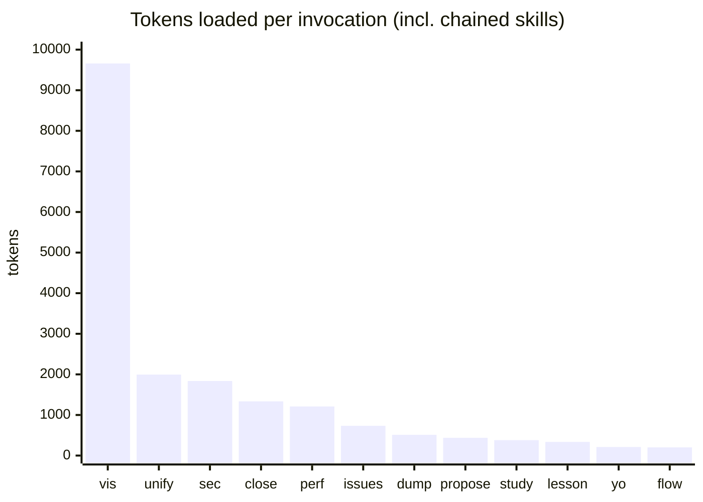

# claude-skills

Personal [Claude Code](https://claude.com/claude-code) skills. Each one is a slash command (`/study`, `/sec`, …) the agent follows step by step.

## Skills, in the order a session uses them

| # | Skill | When | What it does |
|---|---|---|---|
| 1 | `/study` | Start of a session | • Reads README, manifest, entry points, core modules<br>• Maps architecture, conventions, recent git activity<br>• Reads `lessons/` on a fresh session<br>• Prints a structured "ready to build" summary |
| 2 | `/issues` | Choosing work | • Runs `/study` if not done yet<br>• Pulls open GitHub issues via `gh`<br>• Root cause, fix, downstream effects per issue<br>• Ranks them by value-to-effort |
| 3 | `/flow` | Understanding | • ASCII box-and-arrow architecture diagram<br>• One-line legend per component |
| 4 | `/vis` | Understanding (deep) | • Studies the repo, extracts real dependency edges<br>• Builds a 14–18 page landscape PDF on `~/Desktop`<br>• Architecture map, layers, I/O, load, per-feature map + sequence<br>• Needs Node and Chrome/Chromium on macOS |
| 5 | `/yo` | Back from a break | • One line on what's in flight<br>• 3–5 terse status fragments<br>• Small ASCII picture only if relevant |
| 6 | `/lesson` | After fixing a hard bug | • Writes `lessons/YYYY-MM-DD_slug.md`<br>• Symptom, red herrings, root cause, fix, checks for next time |
| 7 | `/perf` | Before push | • Stack-aware performance hypotheses, verified in code<br>• Measures bundle sizes, deps, hot files<br>• Severity-ranked ASCII report<br>• Plans HIGH fixes in plan mode, executes on approval |
| 8 | `/sec` | Before push | • Stack-aware vulnerability hypotheses with realistic exploit paths<br>• Secret, dangerous-API, auth-coverage scans<br>• Severity-ranked ASCII report<br>• Plans HIGH fixes in plan mode, executes on approval |
| 9 | `/unify` | Last gate before push | • UI drift against canonical tokens and components<br>• Architecture diagram vs running services<br>• Model/external calls bypassing the canonical wrapper<br>• Plans HIGH + MED fixes in plan mode |
| 10 | `/propose` | Planning next | • Phased roadmap (NOW / NEXT / SOON / LATER) from session context<br>• Each item: effort · action → measurable result |
| 11 | `/close` | End of session | • Runs `/lesson`<br>• Comments on and closes the GitHub issue worked on<br>• Runs `/issues` to re-rank what's left |
| 12 | `/dump` | Handing off | • Writes `progress/<timestamp>.md` (+ PDF via pandoc)<br>• Overview, state, decisions, how to run, next steps<br>• Manual only: never auto-invoked |

## Token cost

<!-- tokens:start -->
Estimated prompt tokens each skill loads when invoked (~4 chars/token; regenerate with `node scripts/token-costs.mjs`).
Runtime cost (files read, tool output) comes on top and depends on the repo.



| Skill | Own | Chains into | Per invocation | Always loaded (description) |
|---|---:|---|---:|---:|
| `/vis` | 9279 | `/study` | 9659 | 96 |
| `/unify` | 1615 | `/study` | 1995 | 101 |
| `/sec` | 1456 | `/study` | 1836 | 74 |
| `/close` | 265 | `/lesson`, `/issues`, `/study` | 1335 | 43 |
| `/perf` | 830 | `/study` | 1210 | 62 |
| `/issues` | 353 | `/study` | 733 | 48 |
| `/dump` | 511 | — | 511 | 59 |
| `/propose` | 437 | — | 437 | 47 |
| `/study` | 380 | — | 380 | 64 |
| `/lesson` | 337 | — | 337 | 49 |
| `/yo` | 211 | — | 211 | 60 |
| `/flow` | 202 | — | 202 | 40 |
| **All descriptions** | | | | **743** |
<!-- tokens:end -->

## Install

```sh
git clone git@github.com:Banksy-said-hi/claude-skills.git
cp -R claude-skills/skills/* ~/.claude/skills/
```

## Maintaining this repo (for agents)

- Source of truth is `~/.claude/skills/`; this repo is the published copy. Edit locally, then sync here with a private publish step (not in this repo). Never edit here directly.
- One skill = one folder: `skills/<name>/SKILL.md`, frontmatter `name` + `description`. Supporting files sit beside it.
- `description` decides when the skill triggers. Say what it does and end with "Use when the user types /<name>."
- Skills call each other by name (`/issues` → `/study`, `/close` → `/lesson` + `/issues`). Renaming one means updating its callers.
- Keep skills project-agnostic: no personal paths, names, or project-specific tables. Those go in a project's own `CLAUDE.md`.
- Adding, removing, or re-scoping a skill means updating its row in the table above, kept in session order.
- After any skill change run `node scripts/token-costs.mjs`; it rewrites the Token cost section. Never edit that section by hand.
- `skills/vis/vendor/` holds pinned `mermaid.min.js` and `marked.min.js` (MIT), so `/vis` runs offline.
