# vis cookbook

Every snippet here rendered through `build.mjs` with the vendored Mermaid 11.17. Copy the shape,
change the words. Pages are A4 landscape. Fence options: `full` (whole-page diagram), `short`
(diagram with a table under it), `level=1|2|3` (highlights the zoom breadcrumb in the legend).

## The vocabulary (injected automatically, never write classDef yourself)

`build.mjs` appends `vocab.mmd` to every `flowchart` and `block-beta` fence. You only assign classes.

| Kind | Node syntax | Class |
|---|---|---|
| Person | `you([You<br/><small>role</small>])` | `person` |
| Outside system | `x{{Other nodes<br/><small>what it is</small>}}` | `external` |
| Way in | `r[/RPC door<br/>role<br/><small>path</small>/]` | `entry` |
| Core part | `c[Rule checker<br/>role<br/><small>path</small>]` | `core` |
| Background worker | `w@{ shape: procs, label: "Workers<br/>role<br/><small>path</small>" }` | `worker` |
| Data store | `s@{ shape: lin-cyl, label: "Chain store<br/>role<br/><small>path</small>" }` (in block-beta: `s[("...")]`) | `store` |
| Queue or stream | `q@{ shape: das, label: "Job queue<br/><small>path</small>" }` | `queue` |
| File produced | `f@{ shape: doc, label: "debug.log" }` | `artifact` |
| Importance | add a second class | `major`, `normal`, `minor` |
| The repo box | the one subgraph on the architecture page | `repo` |

Box text: line 1 the name, line 2 the role in three to five words, line 3 the path in `<small>`.
Edge text: verb plus object, then format or protocol when known. Direction = where the data goes.
`-->|sends blocks, TCP|` data or call · `-.->|announces new block|` event or async · `==>|hands the block to|` the critical path.

## Layout lesson: a top-to-bottom flowchart fills a landscape page (older, detailed example)

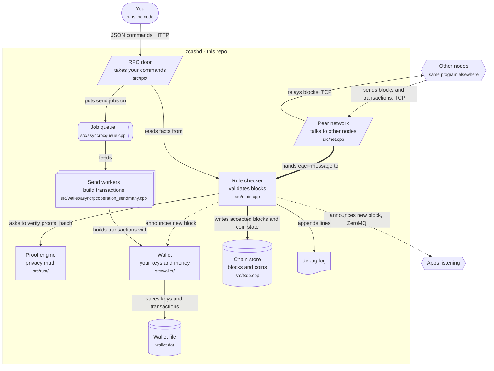

## Page 5: the whole architecture, the abstract map (at most 8 boxes inside the repo, ids reused by every feature page)

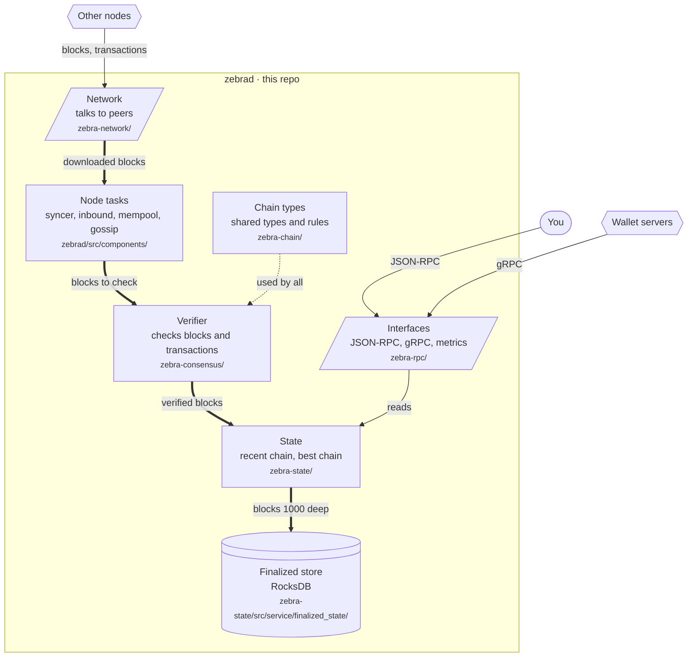

## Feature page: the same map, this feature lit, the rest faded, touched boxes expanded

Same ids as the abstract map. Untouched boxes get `class x faded` and no arrows. A touched box may
become a subgraph with its sub-parts (real paths). Only this feature's arrows are drawn.

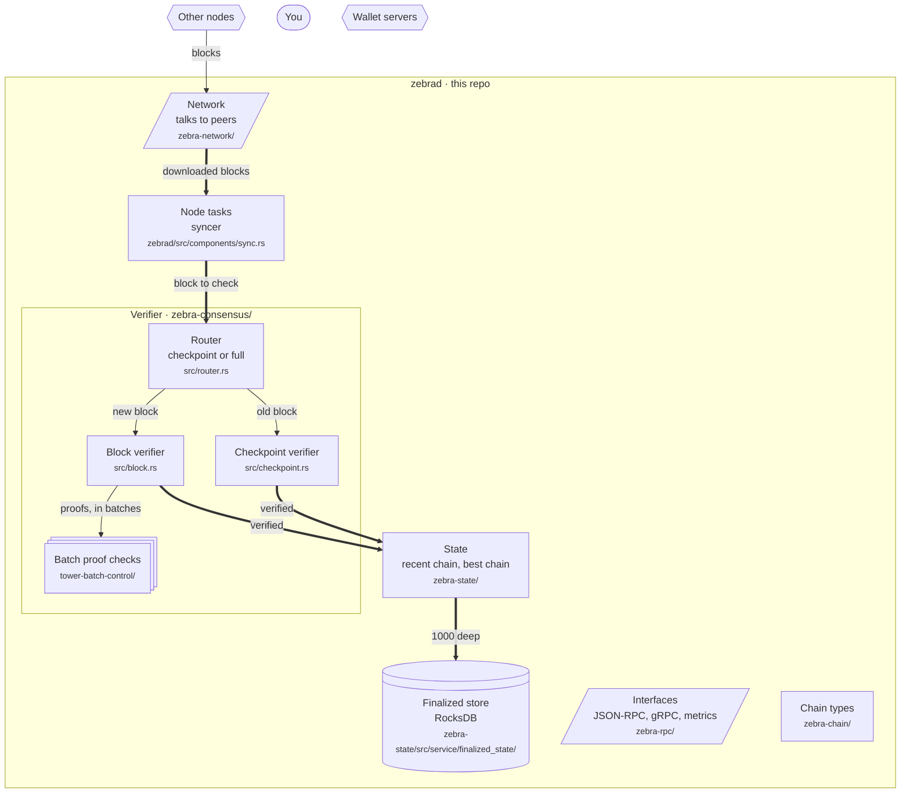

## Page 9: load, the hot path with rates in the arrows and sizes in the boxes

```mermaid short level=2
flowchart LR
  nodes{{Other nodes<br/>25 outbound, up to 125 inbound}}
  net[/Network<br/>one block per 75 s at the tip, thousands per minute while syncing<br/><small>zebra-network/</small>/]
  syncer[Syncer<br/>up to 1000 blocks in flight<br/><small>zebrad/src/components/sync.rs</small>]
  verifier@{ shape: procs, label: "Verifier<br/>proofs batched, one batch per core<br/><small>zebra-consensus/</small>" }
  state[State<br/>one commit per block<br/><small>zebra-state/</small>]
  store@{ shape: lin-cyl, label: "RocksDB<br/>grows every block" }
  nodes -->|blocks| net -->|blocks| syncer ==>|blocks| verifier ==>|verified| state ==>|writes| store
  class nodes external
  class net entry
  class syncer,state core
  class verifier worker
  class store store
```

## Page 2: dictionary, and page 4: data model bullets (formats)

```
<div class="cols">

**Words of the domain.**
- **Block** — a batch of transactions with a header. Blocks form a chain.

**Names used in this document.**
- **Verifier** — the part that checks blocks and transactions. Crate zebra-consensus.

**Technology words.**
- **RocksDB** — a key-value database with named tables called column families.

</div>
```

Data model bullet: `- **Block** — a header plus transactions. Made by miners, checked by the Verifier, stored by the Finalized store in the block_header_by_height column family.`

## Page 7: layers as columns (block-beta, narrow columns with a space between them)

Narrow columns: name plus file basename only. A `space` cell between neighbours gives the
arrows room. `columns` at the top = column blocks + spaces (5 columns → 9). Labels are verb
plus object.

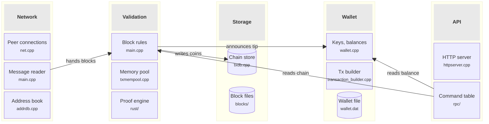

## Page 8: inputs and outputs by component (block-beta grid, no central box)

One row per component: inputs on the left, the component with its load parameters in the
middle, outputs on the right. `columns 4` with the middle cell spanning two (`:2`) so its
text fits. Shapes in block-beta: `{{ }}` outside system, `([ ])` person, `[( )]` store,
`[/ /]` way in. At most 7 rows, short text per cell, no `major` class in grid cells (the
bigger font overflows the cell).

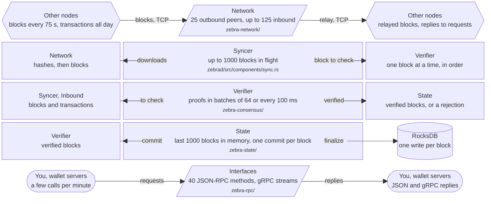

## Page 6: components and responsibilities (table format)

```
| Component | Responsibility | Owns | Must not do | Path |
|---|---|---|---|---|
| Network | Keep connections to peers and move messages in and out | the peer set and address book | check or store blocks | zebra-network/ |
```

## Feature trip page: one trip (sequence, file basename per participant, steps in words, no function names)

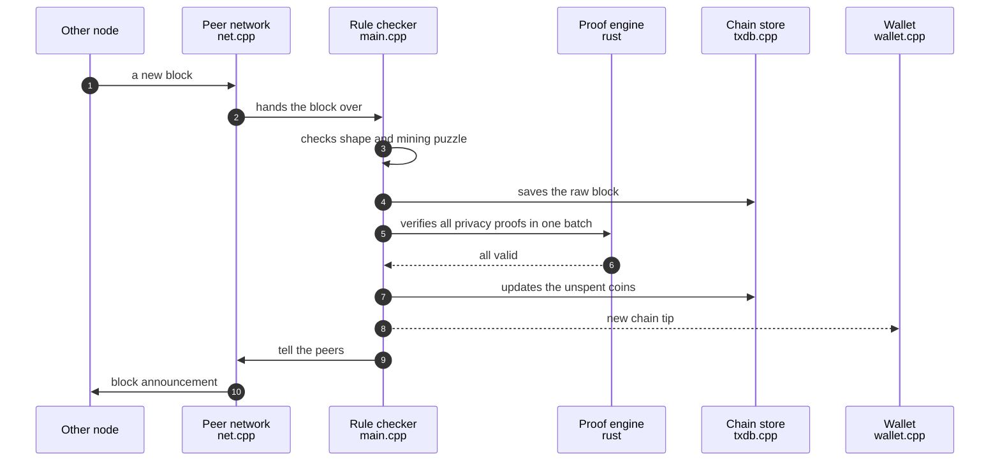

## Page 3: data models (class diagram, fields only)

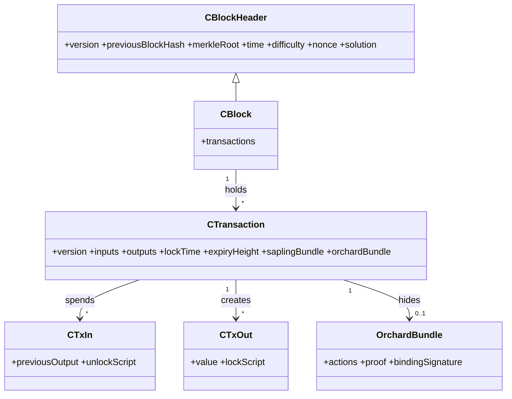

## Menu: stages of a thing (state diagram of the stages one entity passes through)

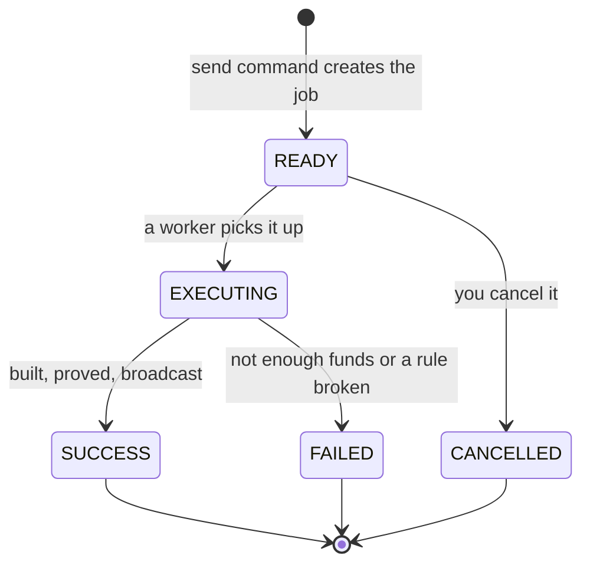

## Menu: where the weight is (treemap, short labels or they vanish)

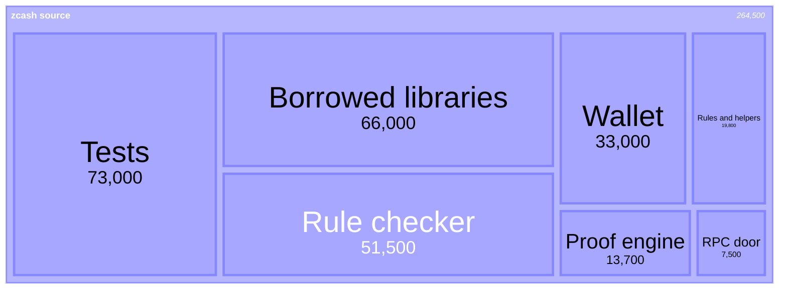

## Menu: threads and processes (flowchart, workers as procs, queues as das)

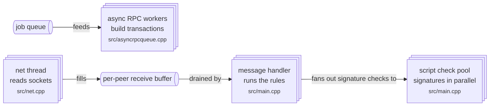

## Menu: deployment view (architecture-beta, only when two or more things run on their own)

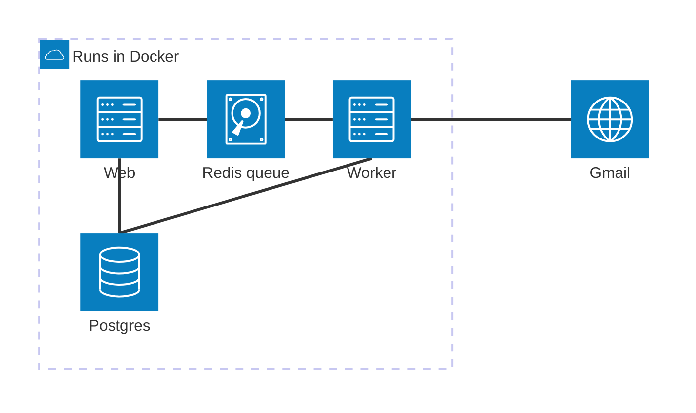

## Last page: where to look next (mindmap, two levels, at most 15 leaves)

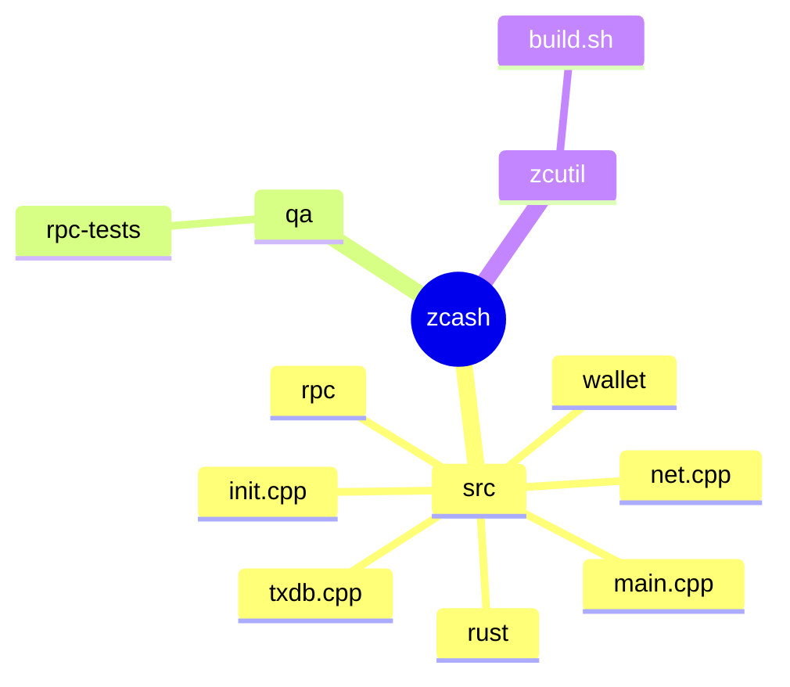

## Page 2: technologies in two flowing columns

Wrap the bullets in a div with class `cols`, with blank lines around the tags, or the page overflows.

```
<div class="cols">

**Language.**
- **C++ 17** — most of the node.

**Storage.**
- **LevelDB** — a simple key-value database for the chain store.

</div>
```

## Menu: threads and processes, as two short strips on one page

When a flow has more than seven steps in a line, split it into two `short` fences on the same page
(for example the network side and the command side). One legend is added for the page.

## Known Mermaid limits, learned the hard way

- `direction TB` inside a subgraph is ignored as soon as any edge touches a subgraph. Invisible links do not fix it. Use block-beta for columns.
- A left-to-right flowchart with many nodes becomes a thin strip. For the full-page architecture use `flowchart TB`.
- Never draw an arrow from deep inside the system back to a person or an outside system (for example "dashboard draws for You"). It closes a cycle, dagre breaks it by moving that person to the middle, and the whole diagram becomes tall and narrow. Put that fact in the box's role line instead.
- Long edge labels stretch the gaps between ranks. Two or three words per arrow on the architecture page.
- Treemap hides the label of any box that is too narrow. Keep labels to two or three words.
- `block-beta` cannot use `@{ shape: ... }`. Use `[( )]` for stores there.
- Do not use Mermaid's C4 syntax. Still beta, poor layout.
